# cs144note
# cflyuke
##  chapter 1 The internet and IP introduction
### 1.1 Networked applications
Doniment model:bidirectional,reliable byte stream connection
- World Wide Web(HTTP)
  - client-server mode
  - HTTP is all in ASCII  
- Bit torrent
  - clients download from other clients
  - torret file ; tracker
- Skype
  - Nat
  - Rendezvous
  - Relay
### 1.2 The Four layer Internet Model
Each layer is some kind isolated.
1. Link layer
   - Ethernet,wifi,4G... 
2. Network layer
   - packet:data + from + to
   - internet protocal (IP)
     - IP makes a best-effort attempt to delivered our datagrams to the other end.But it makes no promises.
     - IP datagrams can get lost,can be dilivered out of order,and can be corrupted.Thers are no gurantees.
  - 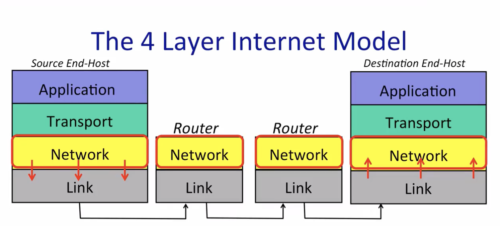
1. Transport
   - TCP:Transmission Control Protocol
   - UDP:User Datagram protocol (no gurantees)
2. Application
   - HTTP,Bit torrent,Skype...
conclusion:
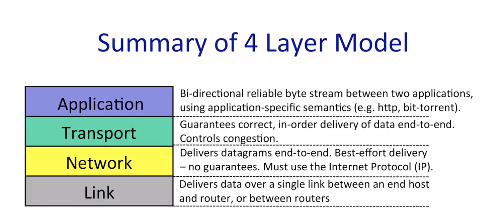
### 1.3 The IP Service Model
1. Property:
 - Datagram:Inidividually routed packets.Hop-by-hop routing. 
   - data + IPSA + IPDA
 - Unreliable:Packets might be droped.
 - Best effort:...but only if necessnary
 - Connectionless:No per-flow state.Packets might be mis-sequenced.
2. The IP Service Model(Detail)
 - Tries to prevent packets looping forever(Time to live "TTL")
 - Will fragment packets if they are too long 
 - Uses a header checksum to reduce chances of delivering datagram to wrong destination
 - Allows for new versions for IP
   - IPV4 Datagram  
     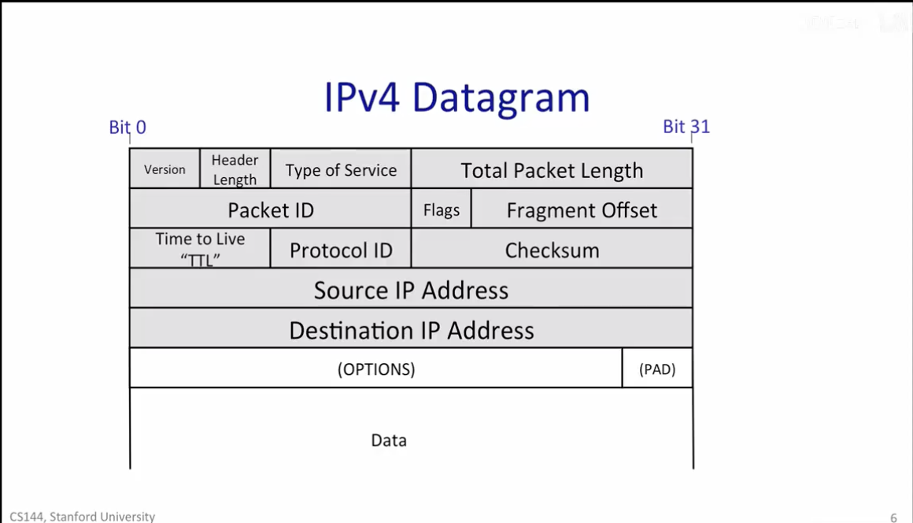
 - Allows for new options to be added ro header
### 1.4 Life of a Packet
TCP Byte Stream
   - three handshake :synchronize(SYN),synchronize and acknowledge(SYN/ACK),acknowledge (ACK)
   - two addresses:
     - Network address:Internet Protocal address
     - transport address:TCP port
   - transport through routers
### 1.5 Principle:Packet Switching
 What is Packet switching?
**Packet**: A self-contained unit of data that carries information necessary for it to reach its destination.
**Packet switching**: Independently for each arriving packet,pick its outing link.If the link is free,senf it.Else hold the pocket for later.
**Flow**:A collection of datagrams belonging to the same end-to-end communication,e.g. a TCP connection.
**No per flow was maintained**
**Data traffic is bursty**
- Packet switching allows flows to use all available link capacity
- Packet switching allows flows to share link capaciy.  
**conclusion**
- Packets are simple:they forward packets independently,and don't need to know about flows.
- Packets switching is efficient:it let us effiently share the capacity among many flows sharing a link.
### 1.6 Principle: Layering
1. layering in a computer system:
edit -> compile -> link -> execute;
2. reasons for layering
  - modularity
  - well definef service
  - reuse
  - seperation of concerns
  - continuous improvement
  - peer to peer communications
### 1.7 Princple :Encapsulation
- weather an encapsulation' head on left or right depends on the use of it.
- 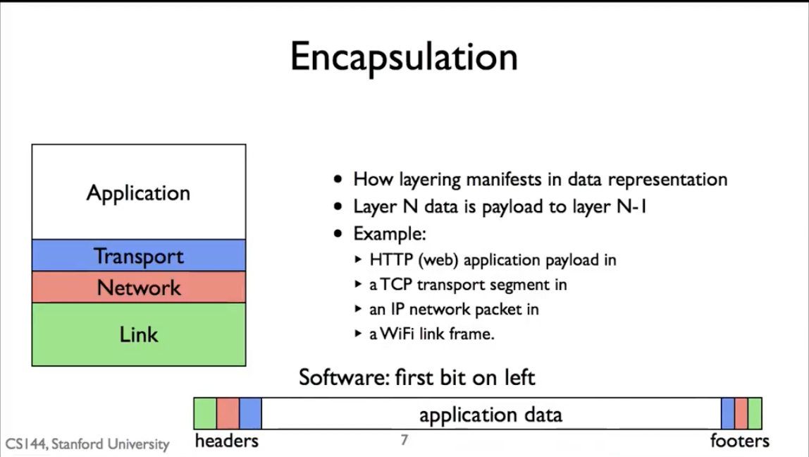
- Encapsulation Flexibility
  - Example:Virtural Private Network(VPN)
  - 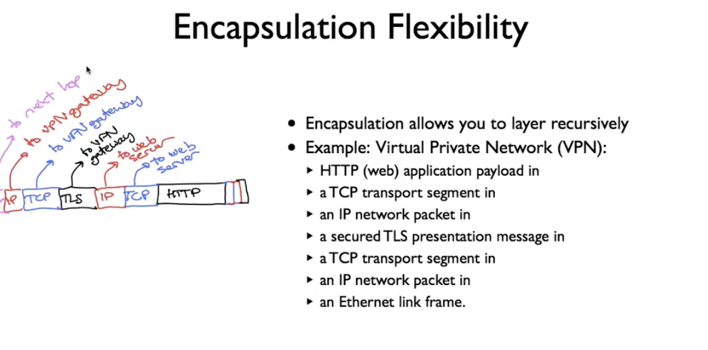
### 1.8 Memory,Byte,Order,and Packet Formats
- Different processors have different endianness
    - Little endian:x86 , big endian:ARM
- To interoperate ,they need to agree how to represent multi-byte fields
- Network byte order is big endian
### 1.9 Names and Address :IPv4
  - An IPv4 address identifies a device on the internet  
      - layer 3 (network) address
      - 32 bits long (4 octets)
      - Netmask:apply this mask,if it matches, in the same network
         - Netmask 255.255.255.0 means if the first 24 bits matches
 - Adress Structure
   - Originallly hierarchical :network + host
     - Network to get to correct network
     - Host to get to correct device in network
   - Originally 3 classes of addresses:calss A,class B,class C
     - 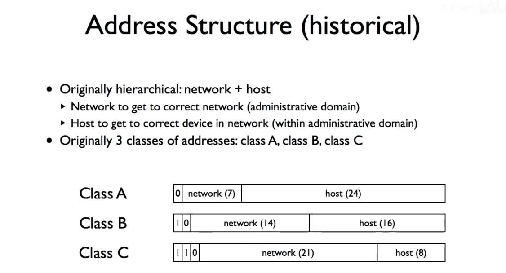
   - Today
     - class inter-Domain Routing(CIDR)
       - Address block is a pair :address and host ;more flexible
 - Adress Assignment
   - IANA:Internet Assigned Numbers Authority
### 1.10 Longest prefix match
Router uses a forwarding table to decide which dest.And it needs to compare IP address with the addresses(with given head) in forwarding table and find the longest one.
### 1.11 Address Resolution Protocol
- Generates mappings between layer 2 and layer 3 addresses
- Simple request - reply protocol
- Request sent to link layer broadcast address
- Reply sent to requesting address
- Packet format includes redundant data 
- No sharing of state:bad state will die eventually
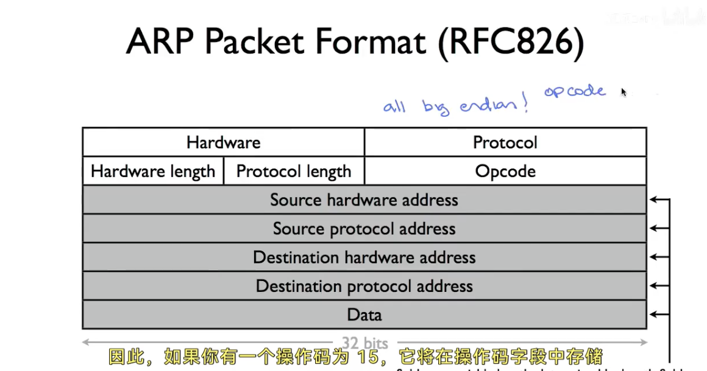
## cahpter 2 Transport
### 2.1 TCP service model
   1.  connection set up: Syn -> SYn/Ack -> Ack;
   2.  connection teardown: Fin -> (Data+)Ack;
   3.  Property
      - Sequence(of first byte):unique,to tell the receiver the package sequence ;and the beginning of the first byte in the package;
      - Acknowledge sequence:to tell the sender those packets(the largest sequence) have been received;flow-control;next expected byte
     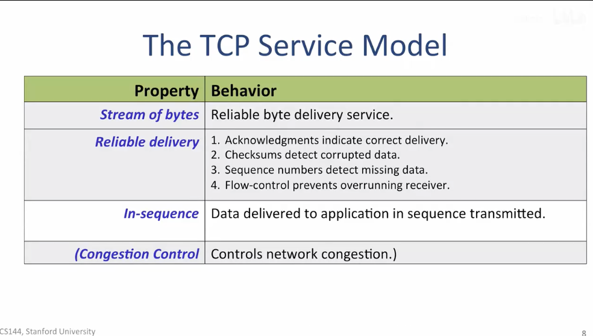
     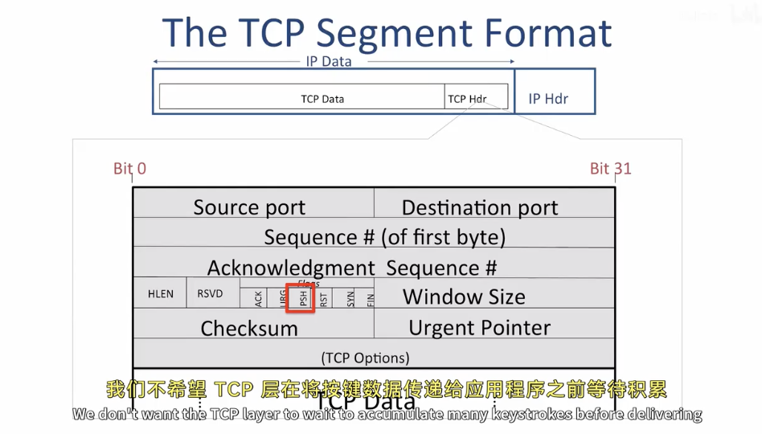
     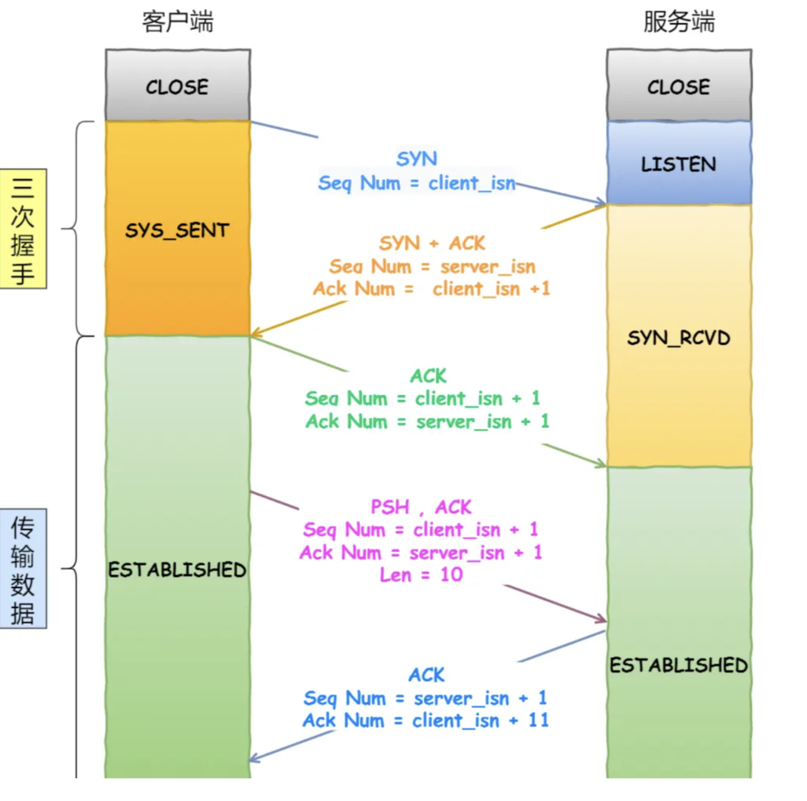
###  2.2 The UDP Service Model
  -  Structure
    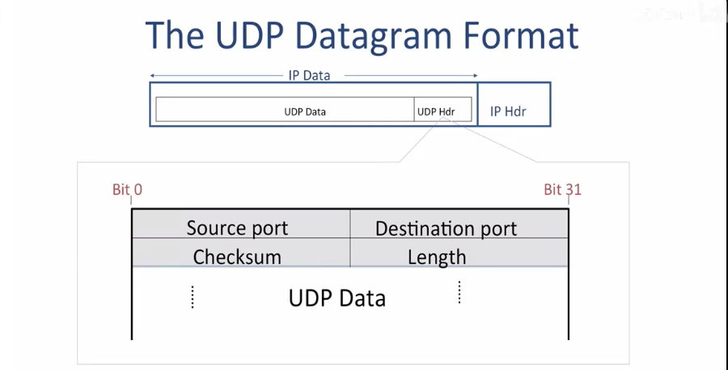
  -  Property
     -  Connectionless:No connection estabilished
     -  Datagram Service:Packets may show up in any order
     -  Self-contained datagrams
     -  Unreliable delivery:
        1. No acknowledgments
        2. No mechanism to detecct missing or mis-sequenced datagrams
        3. No flow-control  
  - eg:DNS 
### 2.3 The Internet Control Message Protocaol (ICMP) Service Model
  1. Making the network layer work
     - The Internet Protocol
     - Routing Tables
     - ==Internet Control Message Protocol(ICMP)==
  2. The ICMP Service Model
     - Reporting Message:Self-contained message reporting error.
     - Unreliable:Simple datagram service - no retries. 
  3. ping & tcptraceroute both rely on ICMP.
     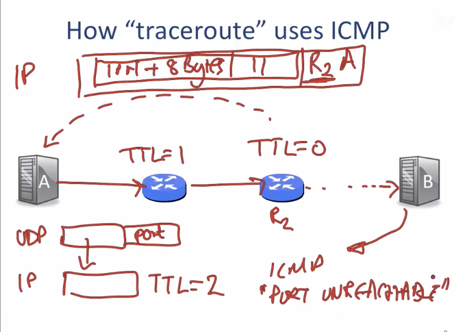
### 2.4 The End-to-End Principle
>"Strong" End to end :
The network's job is to transmit datagrams as efficiently and flexibly as possible.Everything else should be done at the fringes...
### 2.5 Error detection
 1. Three Error detection schemes
    1. checksum adds upvalues in packets(IP,TCP)
    2. cyclic redundancy code computes remainders of a polynomial(Ethernet)
    3. Message authentication code :cryptographic tansformmation of data(TLS)  
       - robust to malicious modifications,but not errors
 2. IP **checksum**
    1. Benefits: fast,easy to compute and check
    2. Draws:poor error detection
 3. **Cyclic redundancy check**
    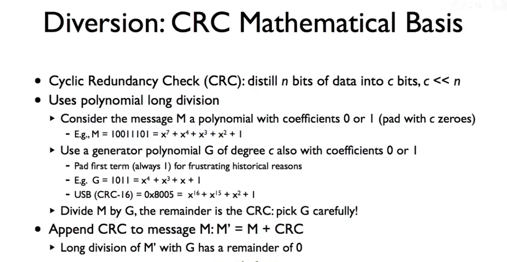
 4.  **Message authenticatin code** 
     - Not to be confused with Media Access Control
     - Mac(M,S)=C;and transport M+C;receiver uses S to decoder.
 5. each layer has its own error detection :**end-to-end principle.**
### 2.6 Finite State Machines
 1. Finite State Machines
    - event causing state transition
    - actions taken on state transition 
  2. FSM example :TCP Connection
   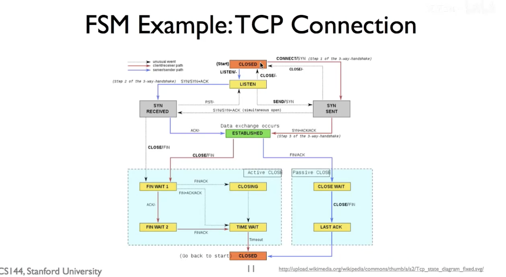
### 2.7 Flow control (Stop-and-wait)
 - At most one packet in flight at one time 
 - stop and wait FSM
  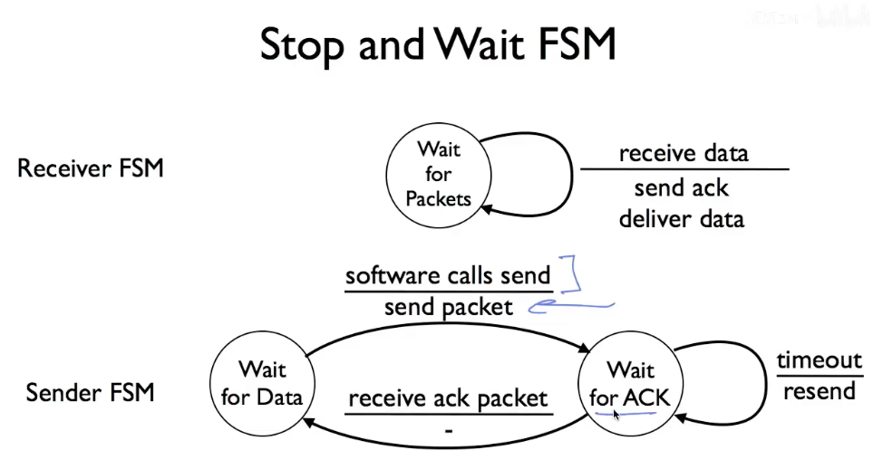
 - duplicates:
   - Use 1-bit counter in data and acknowledgements
   - Some simplifying assumptions 
     - Network does not duplicate packets
     - Packets not delayed multiple timeouts 
### 2.8 Flow control(Sliding window)
 1. Sliding Window Sender
    1. Every segment has a sequence number(SeqNo)
    2. Maintain 3 variables 
       - Send window size(SWS)
       - Last acknowledgement received(LAR)
       - Last segment sent(LSS)
    3. Maintain invariant:(LSS-LAR)$\le$ SWS
    4. Advanced LAR on new acknowledgment
    5. Buffer up to SWS segments
  2. Sliding Window Receiver
     1. Maintain 3 variables
        - Receive window size(RWS)
        - Last acceptable segment(LAS)
        - Last segment received(LSR)
     2. Maintain invariants:(LAS-LSR)$\le$ RWS  
  3. Sequence Space 
    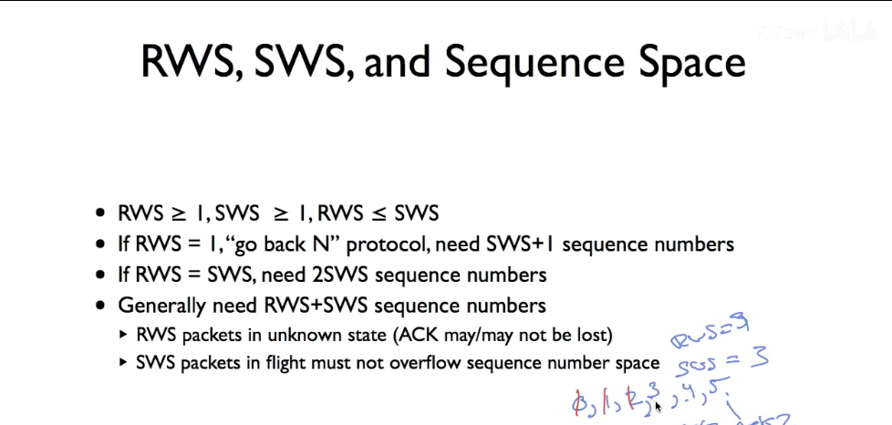
### 2.9 Retransmission Strategies
 - Go-back-N:one loss will lead to entire window retransmitting
 - Selective repeat:one loss will lead to only that packet retansmitting
### 2.10 TCP header
source port +destination port
sequence number
acknowledgement number
offset reserved U|A|P|R|S|F  window(bytes)
checksum   urgent pointer
options padding
### 2.11 Tcp Setup and Teardown
- Tcp Setup
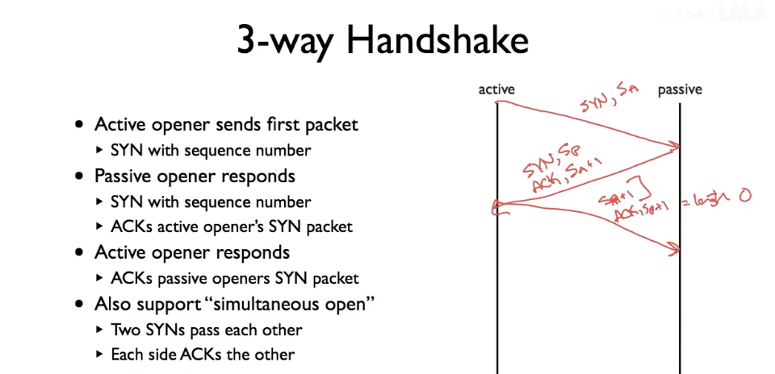
- Tcp Teardown
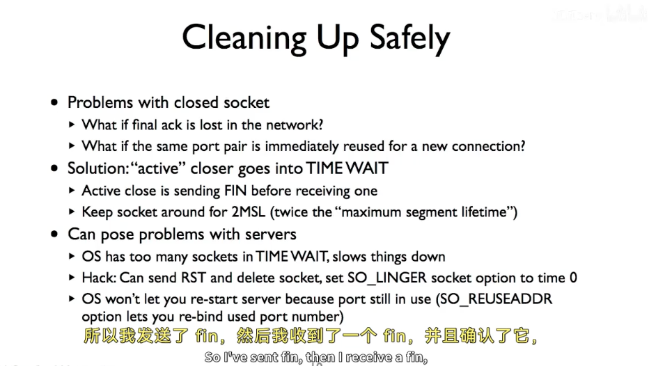
## chapter 3 Packet waiting 

